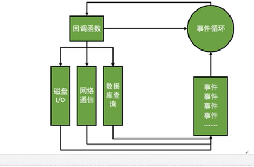

# Node.js

## Node.js简介
- Node不是一种独立的语言，与PHP、JSP、Python、Perl、Ruby的“既是语言，也是平台”不同，Node.js使用JavaScript编程，运行在JavaScript引擎（V8引擎：本身用于Chrome的JS解析）上，让JavaScript的触角伸到了服务器端。

- 与PHP、JSP等相比，Node.js跳过了Apache、Nginx、IIS等HTTP服务器，它不用建设在任何服务器软件上，即Node.js没有web容器。

- Node.js里没有像Apache服务器的应用根目录，没有任何Web容器。不同于Apache，Node.js提供静态服务的方式比较复杂。URL通过Node.js的顶层路由设计，呈递某一个静态文件。

## Node.js的特点
- 单线程、非阻塞I/O、事件驱动：

  - Node.js不为每个客户端连接创建一个新线程，而仅用一个线程，当有用户连接，就触发一个内部事件，通过非阻塞I/O、事件驱动机制，让Node.js程序宏观上也是并行的。单线程还使得操作系统不再有线程创建、销毁的时间开销。但是如果一个用户造成了线程崩溃，整个服务器就崩了。

  - 客户端请求建立连接、提交数据等行为都会触发相应事件。在Node.js中，一个时刻，只能执行一个事件回调函数，但是在执行一个事件回调函数的中途，可以转而处理其他事件（比如又有新用户连接），然后返回继续执行原事件的回调函数，这就是“事件循环”机制。
  - 

  - Node.js底层是C++（V8也是C++），底层代码中，近半数都是用于事件队列、回调函数队列的构建，用事件驱动来完成服务器的任务调度。

  - 总结：单线程——减少了内存开销、操作系统的内存换页，如果一个事情进入了，但是被I/O阻塞了，这个线程就被阻塞了。非阻塞I/O——不会傻等I/O语句结束，而会执行后面的语句。事件机制、事件循环——不管是新用户的请求，还是老用户的I/O完成，都将以事件的方式加入事件循环，等待调度。

## Node.js适合的业务情景
- 当应用程序需要处理大量并发的I/O，而在向客户端发出响应之前，应用程序内部并不需要进行非常复杂处理的时候，Node.js非常适合。Node.js也非常适合与web socket配合，开发长连接的实时交互应用程序。

- Node.js善于I/O但是不善于计算，Node.js最擅长的就是任务调度，如果业务有很多CPU计算，实际上也相当于这个计算阻塞了单线程，就不适合用Node.js开发。

- 比如：用户表单提交、考试系统、聊天室、图文直播、提供JSON的API。

## Node.js总结
- Node.js开发服务器应用（关注：数据、路由），客户端应用（关注：效果、交互）

- Node.js实际上是极客开发的小玩具，不是银弹，特点：单线程、non-blocking I/O、event driven。

- 三者实际上有一体的联系：首先，Node.js不为每个客户端请求开辟一个单独的线程，非常极端地选择了单线程。单线程为了响应所有的请求，不需要有非阻塞I/O，否则一个请求的I/O就可能阻塞其它的请求。一旦有非阻塞I/O，一个请求的进入I/O操作，就会放弃CPU使用权，使得其他请求使用CPU（或者继续此请求I/O操作之后的部分），所以在Node.js下，CPU的利用率100%。如果一个请求的I/O结束，就要用事件来通知线程，执行回调函数。此时必须要有事件环，就有一个排队调度机制。Node.js中有超过半数的C++代码在搭建事件环。

## Modules
- 在Node.js中，以模块为单位划分所有功能，并且提供了一个完整的模块加载机制，这使得我们可以把应用程序划分为各个不同的部分。
- 狭义地说，每一个JavaScript文件都是一个模块，多个JavaScript文件之间可以相互require，他们共同实现了一个功能，整体对外称为一个广义上的模块。
- 模块的好处：减少了重复代码量，增加可读性；方便进行代码规范；方便使用第三方模块。
- Node.js中，一个JS文件中定义的变量、函数，都只在这个文件内部有效。当需要从模块外部引用这些变量、函数时，必须使用exports对象进行暴露。使用者要用require()命令引用这个JS文件。require()别的JS文件时，将执行那个JS文件。
- Node.js中，各个JS文件就是被一个个exports和require构建成为网状结构，而不是像传统HTML文件里同意在一起的那样。
- Node.js中，JS文件之间两种合作模式：
  - （1）某个JS文件中，提供了函数供外部使用，只需要暴露函数：`exports.sayHello = sayHello`
  - （2）某个JS文件中，描述了一个类：`moudle.exports = Person`
- 一个JS文件，可以向外exports无数个变量、函数，但是require的时候，仅仅需要require这个JS文件一次。使用它包裹的变量、函数时，用“.”语法即可。所以无形中增加了一个顶层命名空间（顶层变量）。
- 可以在一个JS文件中描述一个类，用`module.exports = 构造函数名;`的方式向外暴露一个类。
```javascript
// 立即执行函数作用域
(function(){
    window.obj = {};   // 暴露obj（顶层命名空间）
    obj.info = "INFO";
    obj.age = 20;
})();
```

## node_modules文件夹
- 如果在require命令中，这么写：`var foo = requrie('foo.js')`，则Node.js将该文件视为node_modules目录下的一个文件。
- node_moudles文件夹并不一定在同级目录里，在任何直接祖先级目录中，都可以，甚至可以放到NODE_PATH环境变量的文件夹中。这样做分享项目时不需要带着modules一起。
- 可以使用文件夹来管理模块，比如：`var bar = require('bar')`，那么Node.js将会去寻找node_modules目录下的bar文件夹中的index.js去执行。

## package.json
- 如果使用文件夹来统筹管理一个模块，那么需要使用package.json文件来配置，并把此文件放到模块的根目录中。
- 其中的“main”项，就是该模块的入口文件。

## NPM
- NPM的主要功能时安装开发包、管理依赖项。
- `npm install`, `npm update`, `npm init`。

## 路径
- 模块中的任何相对路径，都是相对当前的命令提示符路径，不是相对于此模块本身。
- require()中的路径，是从当前JS文件出发寻找。举个例子：desktop下有a.js、test文件夹（包含b.js、c.js、demo.txt）。a引用b：`var b = require('./test/b.js')`，b引用c：`var c = require('./c.js')`。但是，fs等其他模块用到路径时，都是相对于cmd命令提示符所在位置。所以，在b.js中读取demo.txt时，推荐使用绝对路径：`fs.readFile(__dirname + '/demo.txt', function(err, data){})`。
- require()别的JS文件时，会执行那个JS文件。

## POST请求的接收
- 相比较GET请求，POST请求比较复杂。因为Node.js认为，使用POST请求时，数据量会比较多，为了追求极致的效率，Node.js将数据拆分为众多小数据块（chunk），然后通过特定的事件，将这些小数据块有序地传递给回调函数。
```javascript
var querystring = require('querystring')

var postData = ''
req.addListener('data', function(chunk){
    postData += chunk
})

req.addListener('end', function(){
    console.log(postData)
    var param = querystring.parse(postData)
    res.writeHead(200, {'Content-Type':'text/html;charset=utf8'})
    res.end(param.name)
})
```

- 表单里需要文件上传，则需要给`<form>`添加属性：`enctype="mulitpart/form-data"`。

## 模板引擎
- EJS(Emmbaded JavaScript)
```javascript
var ejs = require('ejs')
var string = 'Hello! My name is White and I am <%= age %> years old.'
var data = {
    age: 18
}
var html = ejs.render(string, data)
console.log(html)
```

# Code Guide

- Hello World，搭建一个简单的web服务器
- 演示案例，说明Node.js没有web容器的概念，呈递的静态文件和URL没有任何关系。访问127.0.0.1/fang，实际显示test文件里里的xixi.html页面；访问127.0.0.1/yuan，实际显示test文件夹里的haha.html页面，相应的图片都要有自己的路由。
- req对象的end、write、writeHead方法。
- req.url的演示，能够得到用户的请求地址。
- url模块，parse方法拆分URL。
- 接收表单GET提交的模拟，可以得到表单提交上来的name、age、sex等，表单是test文件夹里的form.html。
- 当用户访问`/student/1234567890`，查询此学号（10位）的学生信息；当用户访问`/teacher/654321`，查询此工号（6位）的老师信息；如果位数不对，提示位数不对；其它提示错误。
- 案例：给每个访问者加一个id，可以探究Node.js事件机制。
- fs模块的mkdir函数创建文件夹。
- fs模块的stat函数检测文件状态，回调函数里的stats有isDirectory方法，可以判断是否为文件夹。
- 失败案例：列出album文件夹中的所有子文件夹。
- 正确的读取所有文件夹的案例，强行把异步变成同步。
- 一个比较完整的静态资源案例。
- 复习创建简单的HTTP服务器、req.url、实现路由。
- 作业讲解，fs模块，读取文件fs.readFile()，实现一个静态页面显示。
- 模块演示，引用了test文件夹里的foo.js，模块require与exports。
- 模块演示，引用了test文件夹里的People.js类。
- 模块路径名不写“./”则默认是在node_modules文件夹中。
- 引用文件夹。
- NPM演示，下载silly-datetime。
- 模块中的路径。
- 一个外置的router.js，增强程序可读性。
- POST请求提交表单。
- formidable。

- 上传文件，文件名是当前时间：20181020153030111222.jpg


# NodeJS study codes...

echo "# NodeJS_Study" >> README.md
git init
git add README.md
git commit -m "first commit"
git remote add origin https://github.com/Alwaysherewithme/NodeJS_Study.git
git push -u origin master

----
## Hot Node.js

- Node-Webkit
- appjs
- musicquiz
- Jade
- Ghost
- Yamr
- Grunt
- Express.js
- gulp
- Nodecast
- Log.io
- Hyro
- PDFKit
- Haroopad
- NoduinoWeb
- Filsh
- Forever
- NodeOS
- Imdex
- ...


## Study Websites

- [nodejs.org]()
- [npmjs.com]()
- [github.com]()
- [stackoverflow.com]()

## 
CommonJs规范可参考：http://javascript.ruanyifeng.com/nodejs/module.html


模块的分类：核心模块、文件模块、第三方模块


模块的流程：

1、创建模块。teacher.js
2、导出模块。exports.add = function() {}; export是一个对象，可以挂载属性，number,data, string等。
3、加载模块。var teacher = require('./teacher.js);
4、使用模块。teacher.add("Scot");


url.parse(urlstr,[parseQueryString],[stashesDenoteHost])  解析
url.format(urlobj) 格式拼接，获取正确的能解析的地址
url.resolve(from,to) 拼接地址

url.parse():将url字符串转换为url对象 
url.format():将url对象格式化为url字符串 
url.resolve():用于解析，接受两个参数，拼接

//解析url地址为对象
url.parse('一个有参数的URL',true)     //query有解析
url.parse('一个有参数的URL')     //query没有解析
url.parse("//imooc.com",true,true);将第三个参数设置为true后在不知道协议的情况下仍可正确解析域名与路径


一、序列化与反序列化

1、序列化：
querystring.stringify({name:'scott',course:['jade','name']}, ',', ':');

(1){}:url参数.(2)第2个参数的‘，’表示，代替&，（3）第3个参数的':'表示：代替=。

2、反序列化：
querystring.parse('name=scott&course=jade');

querystring.parse('name=scott,course=jade',',');

querystring.parse('name:scott,course:jade', ',', ':');

querystring.parse('name:scott,course:jade', ',', ':', 0);   // 最后一个参数maxKey=0，就对key的个数没有限制了。

二、转译与反转译

1、转译：querystring.escape('<哈哈>');

2、反转译：querystring.unescape();


首先查看浏览器的dns缓存是否存在chrome://net-internals/#dns

如果浏览器的失效，操作系统搜索自身的dns缓存

如果操作系统的dns也没有找到，那么就读取本地的host文件

如果以上都没有就会像运营商发起dns解析请求

然后tcp三次握手建立连接


一、http1.0的请求方法（8种）：
get、post、put、delete、head、trace、options

4xx：客户端错误

5xx：服务端错误

400：客户端语法错误

401：请求没有授权

403：服务端收到请求但拒绝提供服务，可能没有权限等等

404：地址找不到，访问的地址不存在


1. 什么是回调？
回调是异步编程时的基础，将后续逻辑封装成起始函数的参数，逐层嵌套。

2. 什么是同步/异步？
同步是指：发送方发出数据后，等接收方发回响应以后才发下一个数据包的通讯方式。  
异步是指：发送方发出数据后，不等接收方发回响应，接着发送下个数据包的通讯方式。

3. 什么是I/O？
磁盘的写入（in）磁盘的读取（out）。

4. 什么的单线程/多线程？
一次只能执行一个程序叫做单线程。
一次能执行多个程序叫多线程。

5. 什么是阻塞/非阻塞？
阻塞：前一个程序未执行完就得一直等待。
非阻塞：前一个程序未执行完时可以挂起，继续执行其他程序，等到使用时再执行。

6. 什么是事件？
一个触发动作（例如点击按钮）。

7. 什么是事件驱动？
一个触发动作引起的操作（例如点击按钮后弹出一个对话框）。

8. 什么是基于事件驱动的回调？
为某个事件注册了回调函数，但是这个回调函数不是马上执行，只有当事件发生的时候，才会调用回调函数，这种函数执行的方式叫做事件驱动。这种注册回调就是基于事件驱动的回调，如果这些回调和异步I/O(数据写入、读取)操作有关，可以看作是基于回调的异步I/O，只不过这种回调在nodejs中是由事件来驱动的

9. 什么是事件循环？
事件循环——Eventloop，倘若有大量的异步操作，一些I/O的耗时操作，甚至是一些定时器控制的延时操作，它们完成的时候都要调用相应的回调函数，从而来完成一些密集的任务，而又不会阻塞整个程序执行的流程，此时需要一种机制来管理，这种机制叫做事件循环。总而言之就是：管理大量异步操作的机制叫做事件循环。

Event Loop:回调函数队列。异步执行的函数会被压入这个队列; 队列被循环查询。
Node.js靠一个单线程不断查询队列中是否有事件，当读取到一个事件时，将调用与此事件关联的回调函数，事件循环是个先进先出的任务队列，回调函数按照它们被加入队列的顺序来执行。整个队列看成是普通函数、回调函数构成的。

sudo nano /etc/apache2/apache2.conf

Redirect 301 /post1 https://eborchids.com/post2
Redirect 301 https://www.test-wm-profile.perform.plus/login https://test-wm-profile.perform.plus

sudo service apache2 graceful


## What is Express?

ExpressJS is a minimalistic, open source web framework for Node.js
- Used to build powerful web applications and APIs


如何通过饿了么 Node.js 面试:
https://juejin.im/entry/58b00f762f301e0068f968ad

2019 年，19 种方法让自己成为更好的 Node.js 工程师:
https://juejin.im/post/5c222a0c6fb9a04a0604e628

Node.js面试题之2017:
https://blog.fundebug.com/2017/04/10/nodejs-interview-2017/

10个常见的Node.js面试题:
https://www.jianshu.com/p/2e0284db8e1d
https://www.jianshu.com/p/3416a0bf309c

Node.js 的面试题是怎么样的？
https://www.zhihu.com/question/24648388

【译】Node.js 面试问题及答案(2017版):
https://w3ctech.com/topic/1969

https://github.com/jimuyouyou/node-interview-questions

Node.js Stream(流) 简单易懂全解析：
https://www.jianshu.com/p/8738832e7515

Express基本原理
https://www.jianshu.com/p/c5e03b96d07d

Nodejs Express 开发必备知识点
https://blog.csdn.net/hellobeifeng/article/details/49746553

Promise和Async/Await用法整理
https://www.jianshu.com/p/fe0159f8beb4

理解异步之美——Promise与async await（二）
https://baijiahao.baidu.com/s?id=1609291002556086954&wfr=spider&for=pc


https://www.devsaran.com/blog/10-best-nodejs-frameworks-developers
http://nodeframework.com/

Docker 跟 NodeJs 最佳实践
https://www.cnblogs.com/ruicky/p/6595937.html

Docker入门，看这篇就够了
https://segmentfault.com/a/1190000009544565

使用Dockerfile部署nodejs服务
https://segmentfault.com/a/1190000012279808

NODEJS 生成证书
https://blog.csdn.net/fwj380891124/article/details/51758541

